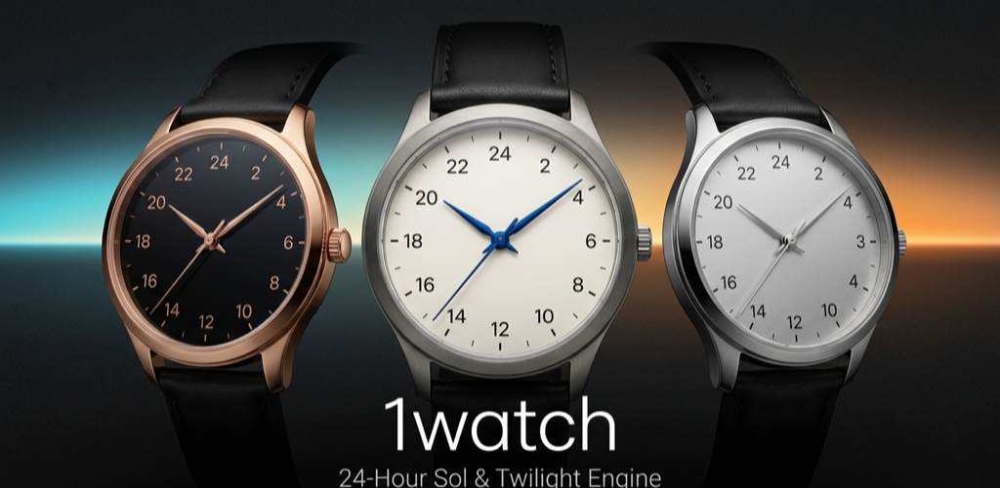
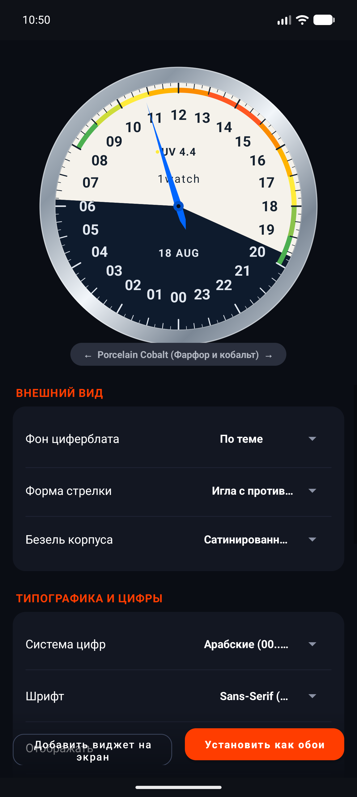
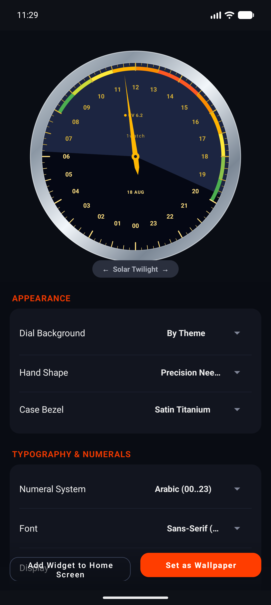
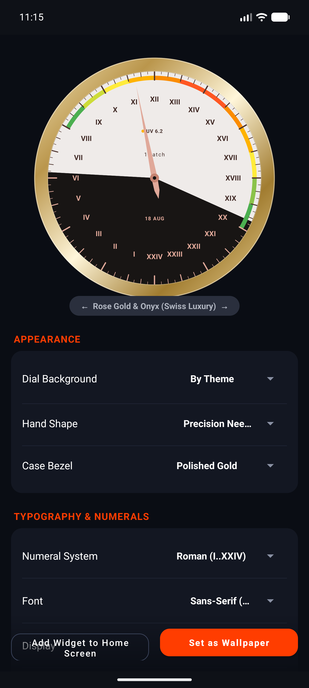
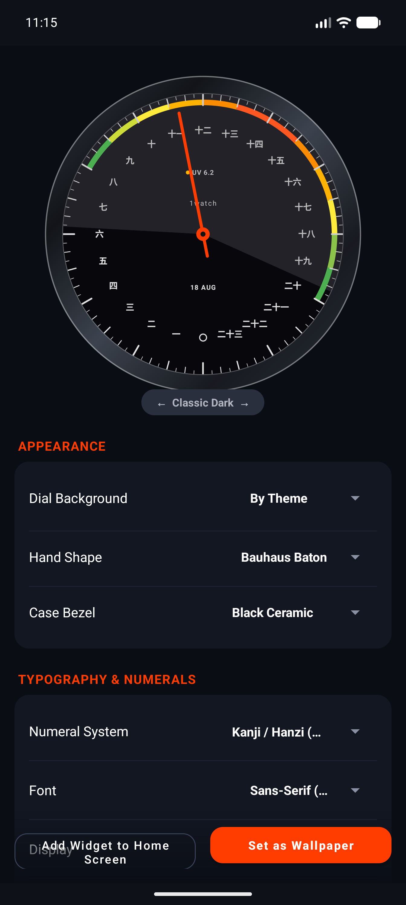
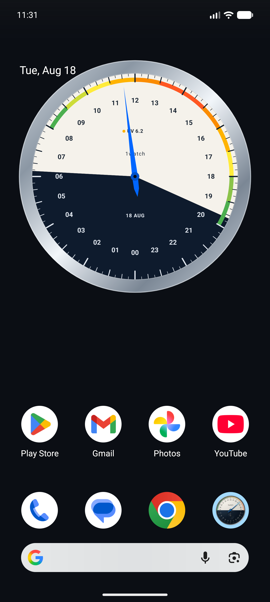
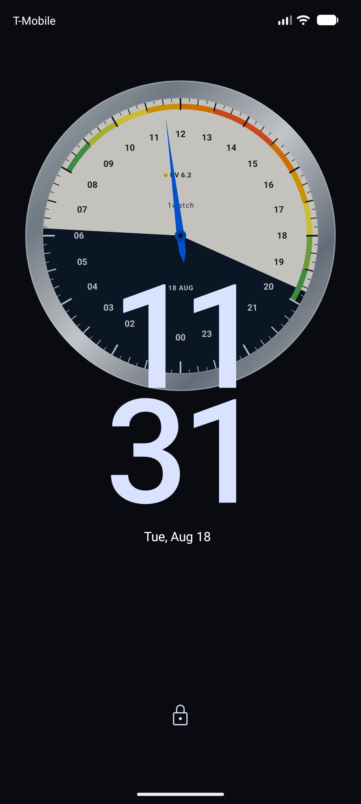

# 1watch — 24-Hour Single-Hand Astronomical Clock & Live Wallpaper

<p align="center">
  
</p>

<p align="center">
  <b>A minimalist, precision 24-hour single-hand timepiece, interactive live wallpaper, and resizable widget for Android.</b>
</p>

<p align="center">
  
  
  
  
</p>

---

## 🌟 Overview

**1watch** redefines how you perceive time. Inspired by traditional astronomical sundials and iconic German single-hand watchmaking (*Botta UNO 24*), the single hand completes **one natural rotation per 24 hours** — moving synchronously with the rhythm of the Earth.

- **12:00 (Noon) at the Zenith:** Follows the sun at its highest celestial peak.
- **00:00 (Midnight) at the Nadir:** Represents deep night.
- **Dynamic Astronomical Horizon:** Calculates exact sunrise, sunset, golden hour, and twilight transitions mathematically on-device using NOAA solar algorithms.
- **Real-Time UV Index Arc:** Visualizes solar ultraviolet radiation across the day with World Health Organization (WHO) color coding.

---

## 📸 Screenshots

<p align="center">
  
  
  
</p>
<p align="center">
  
  
  
</p>

---

## ✨ Features

### ⏱️ True 24-Hour Dial Engine
- Single hand makes **one full rotation in 24 hours** (half the speed of conventional clocks).
- 10-minute division scale with fine 2.5-minute micro-ticks for exact reading at a glance.
- Hardware-accelerated canvas rendering with sub-pixel antialiasing.

### 🎨 14 Curated Dial Palettes
- **Porcelain Cobalt:** Flagship crisp porcelain dial with royal cobalt night hemisphere and blued steel hand.
- **Solar Twilight:** Dynamic sunrise and golden-hour gradient mapping.
- **Rose Gold & Onyx:** Deep black mirror dial with brushed Swiss rose gold accents.
- **Japanese Urushi & Cinnabar:** Traditional vermilion red hand and midnight lacquer dial.
- **Cyberpunk Neon:** High-contrast luminous cyan and hot pink.
- **Bauhaus Minimalist:** Clean monochrome aesthetic.
- **Classic Dark, Arctic Ice, Sage Botanical, Aviator, and more.**

### 💎 Luxury Case Bezels
- **Satin Titanium:** Precision brushed chamfered titanium ring.
- **Black Ceramic:** Mirror-polished high-tech ceramic.
- **Polished Gold & Rose Gold:** Warm metallic reflections.
- **Fluted Stainless Steel & Clean Bezel-less.**

### 🔤 Custom Numeral Systems & Hands
- **Numerals:** Standard 24h Arabic (`00..23`), Classical Roman (`I..XXIV`), Japanese Kanji / Chinese Hanzi (`零..二十三`), and Minimalist Dots.
- **Hand Styles:** Botta Precision Needle, Sport Arrow, Aviator Sword, Bauhaus Baton.

### 📱 Live Wallpaper & Interactive Widget
- **Interactive Live Wallpaper:** Smooth battery-efficient background service. Swipe left/right on your home screen to switch themes on the fly.
- **Lock Screen Support:** Renders seamlessly behind system clock and notification controls.
- **Resizable Home Screen Widget:** High-precision vector widget updating with battery-conscious alarms.

### 🔒 100% Private & Offline
- **Zero Tracking:** No analytics SDKs, no ad frameworks, no user telemetry.
- **Local Astronomy:** Sunrise, sunset, solar noon, and twilight are computed purely through on-device orbital trigonometry.

---

## 🛠️ Architecture & Tech Stack

- **Platform:** Android (Min SDK 26, Target SDK 34)
- **Language:** Kotlin 1.9+
- **UI & Graphics:** Native Canvas 2D, Material Components 3, Custom View hierarchy
- **Services:** `WallpaperService`, `AppWidgetProvider`, `AlarmManager`
- **Build System:** Gradle with ProGuard / R8 full-mode shrinking (~2.8 MB release bundle)

---

## 🚀 Building from Source

1. Clone repository:
   ```bash
   git clone https://github.com/SecH0us3/1watch.git
   cd 1watch
   ```

2. Build Debug APK:
   ```bash
   ./gradlew assembleDebug
   ```

3. Build Signed Release Bundle (.aab):
   ```bash
   ./gradlew bundleRelease
   ```

---

## 📄 Privacy Policy & License

- **Privacy Policy:** See [`PRIVACY_POLICY.md`](PRIVACY_POLICY.md) or [`privacy-policy.html`](privacy-policy.html).
- **License:** MIT License. Free and open source.
